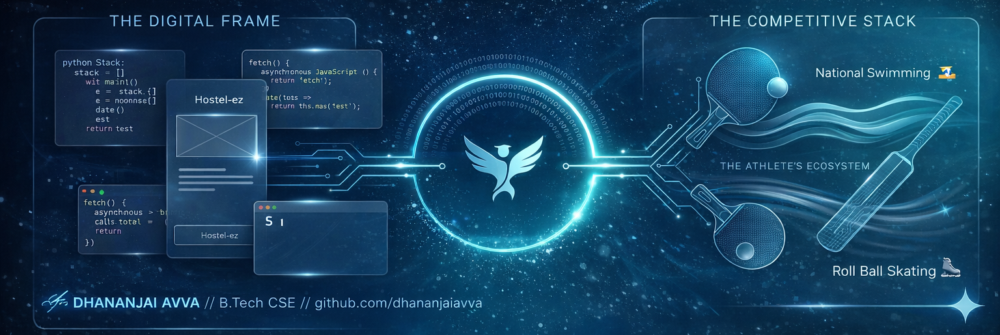

# 👋 Hi, I'm Dhananjai Avva  
### **Computer Science Engineering Student | Web Developer | National-Level Athlete**

  

---

## 💫 About Me
I am a developer who thrives at the intersection of **clean code** and **high performance**. Currently pursuing my B.Tech in CSE at **K.R. Mangalam University**, I build digital solutions that solve real-world problems—from sports analytics to campus management.

* **🏆 The Competitive Edge:** My discipline comes from being a **National-Level Athlete** in Swimming 🏊‍♂️ and Roll Ball Skating ⛸️. I believe the grit required for the field is the same grit required to debug.
* **🎭 Creative Side:** I enjoy performing **Nukkad Nataks** (Street Plays) and traveling.

---

### 🚀 What I’m Building
* **[Statline](https://github.com/dhananjaiavva/statline):** "The Athlete's Ecosystem." A sports analytics platform designed to connect players directly with retailers.
* **[Hostel-ez](https://github.com/dhananjaiavva/hostel-ez):** A digital platform streamlining hostel life—managing attendance, complaints, and fees.
* **[Async Weather Tracker](https://github.com/dhananjaiavva/weather-tracker):** A sleek, glassmorphism dashboard exploring asynchronous JavaScript.

---

### 🛠️ Technical Toolkit

| Category | Technologies |
| :--- | :--- |
| **Frontend** | HTML5, CSS3 (Glassmorphism), JavaScript (ES6+), Figma |
| **Backend & Tools** | Python, Shell Scripting (Linux Automation), Git/GitHub |
| **CS Fundamentals** | Data Structures (Stacks & Queues), System Monitoring, UI/UX Design |

---

## 🌐 Socials & Contact
 
 
 

---

  

## 💻 Tech Stack
     

## 📊 GitHub Stats

   
   
  

---

  

